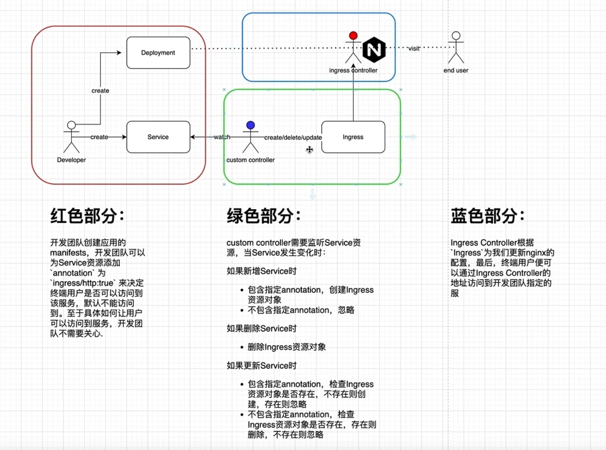

该自定义控制器（Custom Controller）监听 Service 资源的变化，并根据 Service 是否包含指定的注解（annotation）来管理 Ingress 资源对象。

其具体逻辑如下：

•   当新增（Add）一个 Service 时：

    ◦   如果该 Service 包含指定的 annotation，则为其创建一个对应的 Ingress 资源对象。

    ◦   如果该 Service 不包含指定的 annotation，则忽略，不做任何操作。

•   当删除（Delete）一个 Service 时：

    ◦   删除该 Service 对应的 Ingress 资源对象。

•   当更新（Update）一个 Service 时：

    ◦   如果该 Service 包含指定的 annotation：

        ▪   则检查其对应的 Ingress 资源对象是否已存在。

        ▪   如果 Ingress 不存在，则创建它。

        ▪   如果 Ingress 已存在，则忽略，不做任何操作。

    ◦   如果该 Service 不包含指定的 annotation：

        ▪   则检查其对应的 Ingress 资源对象是否已存在。

        ▪   如果 Ingress 存在，则删除它。

        ▪   如果 Ingress 不存在，则忽略，不做任何操作。




- 蓝色部分 nginx controller

```bash
kubectl apply -f https://raw.githubusercontent.com/kubernetes/ingress-nginx/controller-v1.13.3/deploy/static/provider/cloud/deploy.yaml
```

- 红色部分

```yaml
apiVersion: v1
kind: Pod
metadata:
  name: nginx
  labels:
    app: nginx
spec:
  containers:
  - name: nginx-container
    image: nginx:latest
    ports:
    - containerPort: 80
---
apiVersion: v1
kind: Service
metadata:
  name: nginx
spec:
  selector:
    app: nginx  # 这个选择器与 Pod 的标签匹配
  type: ClusterIP  # 默认类型，可不写，但为了清晰建议写上
  ports:
  - port: 80        # Service 暴露的端口
    targetPort: 80  # Pod 容器暴露的端口
```

